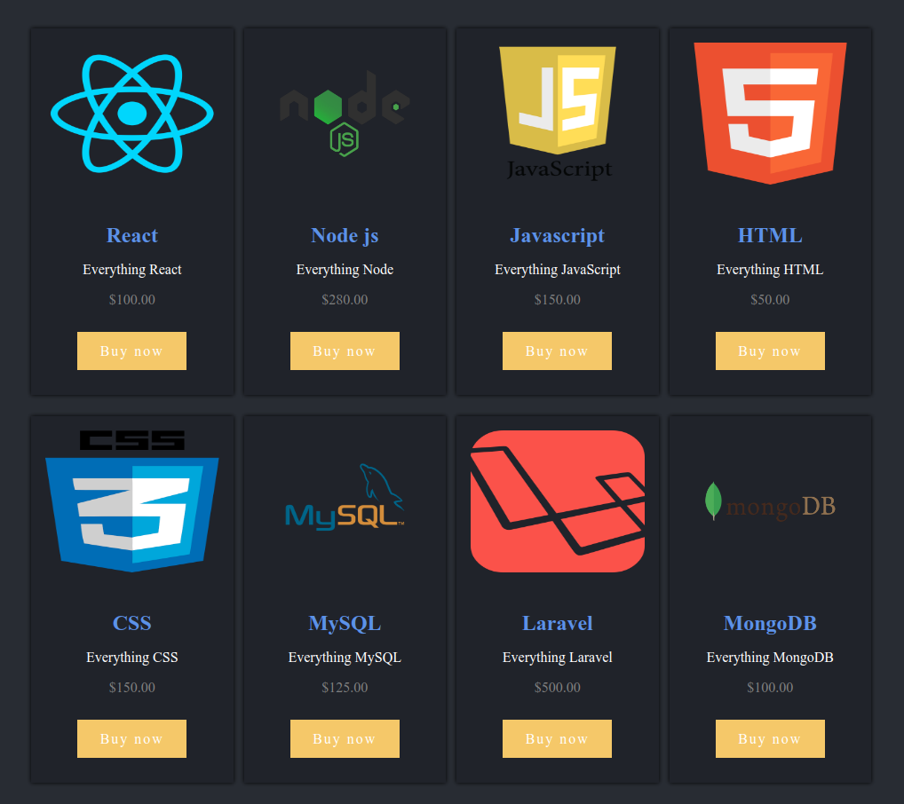
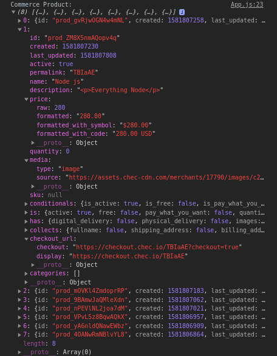

<h1 align="center"> Listing products in a catalog using the using React.js and Commerce.js SDK! </h1>

In this guide, we will setup a [React.js](https://reactjs.org/docs/getting-started.html) and [Commerce.js](https://commercejs.com/) application!



In this guide we're using Commerce.js SDK v2

### View demo

[https://jonamparo.github.io/commerce/index](https://jonamparo.github.io/commerce/index)

## Overview

Get your React + Commerce.js application started!

1. Setup your React application
2. Inject Commerce.js onto your application
3. Display your Commerce store onto your application

### Requirements

- Any Command Line Interface
- [NPM](https://www.npmjs.com/get-npm) or [Yarn](https://classic.yarnpkg.com/en/docs/install)
- [Node.js](https://nodejs.org/en/download/), v8+
- Any code editor

### Prerequisites

This guide suggests that you have knowledge of the following concepts:

- Some knowledge of React.js, HTML, CSS, and Javascript
- Some knowledge of how APIs work
- Some knowledge of the [command line interface](https://www.google.com/search?q=command%20line%20interface)

### Project setup

In this setup, we'll be using the React.js framework.

### 1. Install React.js

```
npx create-react-app commerce-app
```

### 2. cd into your project directory

```
cd commerce-app
```

### 3. Install and inject Commerce.js into your app

In order to fetch data from the backend, we need to install Commerce.js SDK:

```
npm install @chec/commerce.js
```

Once that's installed. Navigate into your project and open up the `src/App.js` file with your code editor. Now we can link up our Commerce to our application. Copy and paste the below code into your App.js file.

**src/App.js**

```javascript
// Import Commerce.js
import Commerce from '@chec/commerce.js';

// Let's get started by creating a new Commerce instance!
// To get your public key please visit:
// [https://dashboard.chec.io/setup/developer](https://dashboard.chec.io/setup/developer)
const commerce = new Commerce('PUBLIC KEY HERE', true);
```

Once the code is in your editor, let's add our [public key](https://dashboard.chec.io/setup/developer) to the code we just entered.

[Get your key](https://dashboard.chec.io/setup/developer)

```javascript
const commerce = new Commerce('PUBLIC KEY HERE', true);
```

### 4. Fetch the products from your store

Now that we've entered our [public key](https://dashboard.chec.io/setup/developer), we should be properly connected. Now, we can begin to fetch our data from our store. 🥳 If you haven't added items to your store. Make sure to do that. [Click this link to begin uploading your products now](https://dashboard.chec.io/products)!

Now that you've uploaded products, let's remove the code in your `src/App.js` so that we have a blank file. Now, let's copy the code below, and paste it into your `src/App.js` file. Note - This is a decend starter template to begin a commerce.js project.

**src/App.js**

```javascript
import React, { useState, useEffect } from 'react';
import Commerce from '@chec/commerce.js';
// Let's get started by creating a new Commerce instance!
const commerce = new Commerce('PUBLIC KEY HERE', true);

const App = () => {
  // This variable will hold our products data
  const [product, setProduct] = useState([]);

  // Fetches data from the Chec API to the "product" variable
  useEffect(() => {
    commerce.products.list().then(result => {
      setProduct(result.data.map(product => product));
    });
  }, []);

  console.log('Commerce Product: ', product);

  return <section className='product-list'></section>;
};

export default App;
```

**Make sure you still have the public key you entered on your Commerce instance.**

### 5. Confirming that your fetch was a success!

Now that we have the code above in our application. Let's check out our store! Let's begin by starting our local enviornment:

`npm run start`

**Open up your Browser DevTools (Console/Inspecter)**

You can open up your DevTools by entering the key combination with your working operating system.

- Windows/Linux `(Ctrl + Shift + i)`
- MacOS `(Cmd + Shift + i)`

Now that we have our DevTools up, navigate to the "Console" tab. We should see a "Commerce Product" message inside of our console. Expand it and you should see the information to your store. It should look similar to the image below. (See image below)



Congratulations! 🥳 Your connection to the store is a success! Now let's use that data that we're retrieving, and display it onto our application.

### OPTIONAL: Add styling to your project.

Let's also add some styling to give the project a nice touch.

1.  Head over to our `src/index.css` file.
2.  Remove all text from the file.
3.  Copy the code below, and paste it into the `src/index.css` file.

**src/index.css**

```css
body {
  margin: 0;
  background-color: #282c34;
}

a {
  text-decoration: none;
  letter-spacing: 2px;
}

a:hover {
  color: cornflowerblue;
  text-decoration: underline;
}

.product-list {
  display: grid;
  grid-template-columns: repeat(5, 1fr);
  grid-auto-rows: 1fr;
  grid-column-gap: 0.75rem;
  grid-row-gap: 1.5rem;
  padding: 5rem 2.5rem;
  color: white;
  text-align: center;
  flex-wrap: wrap;
}

@media only screen and (max-width: 1200px) {
  .product-list {
    grid-template-columns: repeat(4, 1fr);
  }
}

@media only screen and (max-width: 992px) {
  .product-list {
    grid-template-columns: repeat(3, 1fr);
    padding: 5rem 0.6rem;
  }
}

@media only screen and (max-width: 768px) {
  .product-list {
    grid-template-columns: repeat(2, 1fr);
  }
}

.product {
  box-shadow: black 0px 0px 5px 0px;
  transition: transform 0.3s;
  background-color: #20232a;
}

.product:hover {
  transform: scale(1.02);
}

.product-image {
  margin: 1rem;
}

.img {
  height: 10rem;
  width: 100%;
}

.product-detail {
  margin: 2.5rem 0;
}

.title {
  color: cornflowerblue;
  margin: 0 0.5rem 1rem;
}

.description {
  margin: 0.5rem;
}

.price {
  color: gray;
  margin-bottom: 2.5rem;
}

a.btn {
  background-color: #f1c65c;
  color: black;
  padding: 0.8rem 1.6rem;
  cursor: pointer;
  border-color: #f1c65c;
  color: white;
  text-decoration: none;
}

a.btn:hover {
  background-color: #ad8b34;
  border-color: #ad8b34;
  color: white;
}
```

😅 Now that we have that in our project! Let's display our data on the client-side.

## 6. Display your product onto your application

Now that we have our data being rendered into our `product` variable. Let's display our products!

**a) Add markup to display the name of our product!**

Inside of our `src/App.js` file, let's add some code to display our data to our application.

- Go to your `src/App.js` file
- Remove `return <section className='product-list'></section>`
- Copy the code below and paste it where you just removed code

**src/App.js**
(Line 19)

```javascript
return (
  <section className='product-list'>
    {/* Iterate through our product array and return/render it out onto our page */}
    {product.map((product, index) => (
      // Product box that holds our product information
      <div key={index} className='product'>
        {/* Image of your product */}
        <div className='product-image'>
          
        </div>

        {/* Product details (name, description, and price) */}
        <div className='product-detail'>
          {/* Product name */}
          <h2 className='title'>{product.name}</h2>

          {/* Product description */}
          <p className='description'>{product.description}</p>

          {/* Displays price formatted with symbol($10.00) */}
          <p className='price'>{product.price.formatted_with_symbol}</p>
        </div>
      </div>
    ))}
  </section>
);
```

Et voila! 🥳 Now we have our data displayed onto the client-side of our application!

## 7. Description fix!

Everything is looking good! Our image is showing, the title is glowing, the description is looking 😱! Oh, no! The description is showing <p> HTML elements! It's okay, we can get that fixed! Let's go back into our `src/App.js` file. On line 9, right below `const [product, setProduct] = useState([]);` , let's add the following code below:

**src/App.js**

```javascript
// Helper function to express our description into a regular string
const regex = /(<([^>]+)>)/gi;
```

Now let's go down to our return statement and look for

```javascript
<p className='description'>{product.description}</p>
```

Let's replace that with this:

```javascript
<p className='description'>
  {/* Remember we added a helper function at the top of the file? This regex helps render this expression into a regular string without the HTML element tags. */}
  {product.description.replace(regex, '')}
</p>
```

This is a [regex](https://www.regular-expressions.info/) that replaces a special pattern that is within the text. So we made an expression that got rid of the `<p>` element from our description tag. Pretty neat!

## OPTIONAL: Add a buy button and link it to our checkout.

Inside the our `src/App.js` file, below this line `<p className='price'>{product.price.formatted_with_symbol}</p>`. Let's add this code underneath it.

```javascript
<a href={product.checkout_url.display} className='btn'>
  Buy now
</a>
```

Now we should have a buy button! If we go back to our page and click the button. You'll notice that it'll take us to a checkout page for that item. Awesome!

## Next steps!

Congratulations! 🥳 You've built the client-side of our application successfully! Let's look at the next steps that you could do to extend your application, and have a fully working commerce application!

1. [Add products to cart](https://commercejs.com/docs/examples/add-to-cart.html)
2. [Retrieve cart contents](https://commercejs.com/docs/examples/retrieve-cart-contents.html)
3. [Capture a checkout](https://commercejs.com/docs/examples/capture-checkout.html)

## Built with

- [React.js](https://reactjs.org/docs/getting-started.html) - The web framework used
- [Create React App](https://reactjs.org/docs/create-a-new-react-app.html) - Tool to build my react application
- HTML5, and CSS - Other languages that I used

## Author

- **Jonathan Amparo** - [Github](https://github.com/jonamparo) // [Email](mailto:JonathanMAmparo@gmail.com)

## Ending notes

If you would like to contribute or add any feedback to how we can improve the documentation. Please let us know, we're always looking to improve. Thank you.

To join our community, [click here!](https://chec-commercejs-community.herokuapp.com)

Want to check out other documentations, API, blogs, resources and guides? Check out the links below!

[Documentations](https://commercejs.com/docs/) / [Resources](https://commercejs.com/resources/) / [Blogs](https://commercejs.com/blog) / [API](https://commercejs.com/docs/api/#introduction)

Any other guides you would like? [Let us know.](https://chec-commercejs-community.herokuapp.com)
